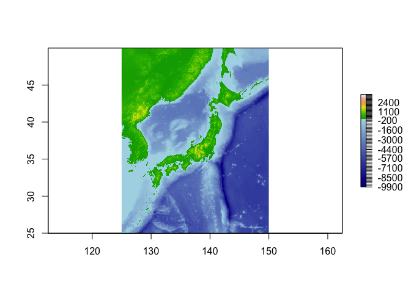
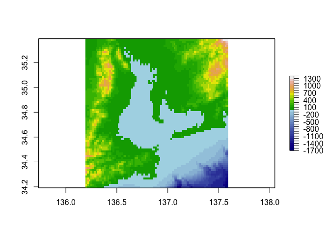

# 日本周辺の海底地形図をRで描く

## 1．ライブラリーの読み込み

これらのRライブラリを事前にインストールしてください

``` r
library(sp)
library(raster)
library(ade4)
library(ecospat)
library(usdm)
library(gridExtra)
library(ggplot2)
library(reshape2)
```

## 2．深度・標高のカラーリング用関数の定義

参照サイト(<https://www.benjaminbell.co.uk/2019/08/bathymetric-maps-in-r-colour-palettes.html>)

``` r
# Function to calculate colour break points
# x = raster, b1 & b2 = number of divisions for each sequence, r1 & r2 = rounding value
colbr <- function(x, b1=50, b2=50, r1=-2, r2=-2) {
     # Min/max values of the raster (x)
    mi <- cellStats(x, stat="min")-100
    ma <- cellStats(x, stat="max")+100
    # Create sequences, but only use unique numbers
    s1 <- unique(round(seq(mi, 0, 0-mi/b1),r1))
    s2 <- unique(round(seq(0, ma, ma/b2),r2))
     # Combine sequence for our break points, removing duplicate 0
    s3 <- c(s1, s2[-1])
    # Create a list with the outputs
     # [[1]] = length of the first sequence minus 1 (water)
     # [[2]] = length of the second sequence minus 1 (land)
     # [[3]] = The break points
    x <- list(length(s1)-1, length(s2)-1, s3)
}
```

## 3．海域/陸域のカラーパレットの定義

``` r
blue.col <- colorRampPalette(c("darkblue", "lightblue"))
```

## 4．日本周辺の海底地形データの読み込み

-   NOAAが提供するグローバル地形データ[ETOPO1](https://www.ngdc.noaa.gov/mgg/global)を元データとして、日本周辺域（東経115°—160°,
    北緯25°-60°）を切り出したデータを使用。
-   ETOPO1はWGS84回転楕円体に準拠した全球1分メッシュ、格子点数4億6656個のデータから構成される。

``` r
#ETOPO1_geo <- raster("ETOPO1_Bed_g_geotiff.tif")
#JPN_ext <- extent(125,150,25,60)
#ETOPO01_JPN_geo <- crop(ETOPO1_geo, JPN_ext)
#writeRaster(ETOPO01_JPN_geo, "ETOPO1_geo_JPN.tif", overwrite=T)
ETOPO1_geo_JPN <- raster("ETOPO1_geo_JPN.tif")
```

## 5．深度/標高のカラーリング用関数を適用

``` r
ETOPO1_geo_JPN.br <- colbr(ETOPO1_geo_JPN)
```

## 6．日本周辺の海底地形データの描写

``` r
plot(ETOPO1_geo_JPN, col=c(blue.col(ETOPO1_geo_JPN.br[[1]]),terrain.colors(ETOPO1_geo_JPN.br[[2]])),breaks=ETOPO1_geo_JPN.br[[3]])
```



## おまけ．伊勢湾の海底地形データの描写

このスケールだとETOPO1では粗さが目立つので、より高精度なデータ（JTOPO30:緯度経度30秒グリッド)を使いたいところです。

``` r
#伊勢湾周辺の抽出
IseBay_ext <- extent(136.2,137.6,34.2,35.4)
ETOPO1_geo_IseBay <- crop(ETOPO1_geo_JPN, IseBay_ext)
#カラーリング用関数の適用
ETOPO1_geo_IseBay.br <- colbr(ETOPO1_geo_IseBay)
#プロット
plot(ETOPO1_geo_IseBay,col=c(blue.col(ETOPO1_geo_IseBay.br[[1]]),terrain.colors(ETOPO1_geo_IseBay.br[[2]])),breaks=ETOPO1_geo_IseBay.br[[3]])
```



------------------------------------------------------------------------
