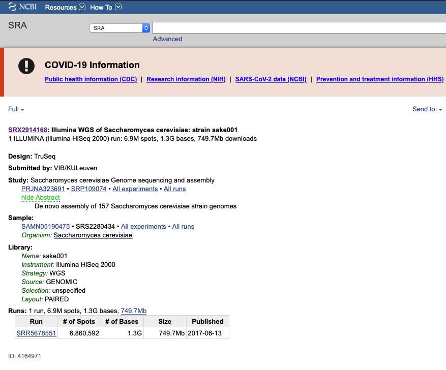

# NGSデータ解析チュートリアル


平尾　章

水産研究・教育機構 水産資源研究所
水産資源研究センター 漁業情報解析部　資源解析グループ


----

# 概要

初心者向けのNGSデータ解析のチュートリアルです。公開NGSデータの取得から変異検出までの解析手順の流れについて、酵母のリシーケンス解析 (illuminaショートリード) を例に学びます。

----
# 目次
### 1. [はじめに](#はじめに)

### 2. [Single&nbsp;sample&nbsp;genotypingのワークフロー](#Single&nbsp;sample&nbsp;genotypingのワークフロー)
　2.1. [公開データ取得](#公開データ取得)

　2.2. [リードのクオリティーコントロール（QC）](#リードのクオリティーコントロール（QC）)

　2.3. [マッピング](#マッピング)

　2.4. [変異検出](#変異検出)

### 3. [Joint genotypingのワークフロー](#Joing&nbsp;genotypingのワークフロー)
3.1 [公開データ取得から変異検出まで](#公開データ取得から変異検出まで)


### 4. [その他](#その他)

4.1 [ゲノムビューワーによる変異の視覚化](#ゲノムビューワーによる変異の視覚化)


---

<h1 id="はじめに">1.&nbsp;はじめに</h1>

出芽酵母（ *Saccharomyces* *cerevisiae* ）は、真核生物として最初にゲノムが解読されたモデル生物です。ゲノムサイズ（12.1Mb）が小さいため、塩基配列データもコンパクトで扱いやすく、高スペックの計算機でなくてもデータ解析をおこなうことができます。酵母のリシーケンスを例題として、公開データの取得から変異検出までの解析処理の流れを学びます。

本チュートリアルの解析環境は、Ubuntuマシンに[使用NGSツールのリスト](#使用NGSツールのリスト)がインストール済みであることを想定しています。Macにおけるツール類の環境構築については、[上坂一馬さんのブログ](https://kazumaxneo.hatenablog.com/entry/2019/10/16/122613) が参考になります。

変異検出のパイプラインは、[GATKのgermline sort variant discoveryのワークフロー](https://gatk.broadinstitute.org/hc/en-us/articles/360035535932-Germline-short-variant-discovery-SNPs-Indels-)に基づいています。このワークフローのジェノタイピングには single sample genotyping と joint genotyping の２つの方法があります。Single sample genotypingは１サンプルずつで処理するために、結果を逐次的に素早く取得することができます。一方で、joint genotypingではすべてのサンプルからの情報を活用して変異を検出するために、誤差が少なく高精度の推定結果が得られます。しかしながら計算コストが増加することに加えて、サンプルが追加されるたびにjoing genotyping処理をやりなおすといった手間が必要になります。解析の目的や時間的制約に応じて、single sample genotyping と joint genotypingを使い分けるとよいでしょう。

---

<h1 id="Single&nbsp;sample&nbsp;genotyping">2.&nbsp;Single&nbsp;sample&nbsp;genotypingのワークフロー</h1>

<h2 id="公開データ取得">2.1.&nbsp;公開データ取得</h2>

### 2.1.1. シーケンスリードの取得

酵母のリシーケンスの生リードデータ [SRR5678551](https://www.ncbi.nlm.nih.gov/sra/SRR5678551) (Whole genome sequence of <i>Saccharomyces cerevisiae</i>: strain sake001)を公共データベースからダウンロードします。

[SRR5678551](https://www.ncbi.nlm.nih.gov/sra/SRR5678551) のメタ情報は、illumina Hiseq 2000 で解読したペアエンドリード（一つのDNA断片に対し、5'側と3'側の両末端から各々に読まれたシーケンスリードのペア）であることを示しています。



ダウンロードする前に、こんな感じでメインの作業フォルダおよびリードデータの保管フォルダを作っておきます。
```
user_name=hogehoge #アカウント名:hogehogeの場合
main_folder=/home/$user_name/work/Scer
fastq_folder=$main_folder/fastq
mkdir -p $fastq_folder
cd $fastq_folder
```
ブラウザからは直接fastq形式のリードデータをダウンロードすることはできません。そこでSRA-toolkitのfastq-dumpコマンドを使って、生リードデータ [SRR5678551](https://www.ncbi.nlm.nih.gov/sra/SRR5678551) を[DRA/SRA/ERAデータベース](https://www.ddbj.nig.ac.jp/dra/index.html)からダウンロードします。NGSツールを使う際には、解析の再現性担保のために、そのツールのバージョンを確認することが大切です。
```
fastq-dump --version
```
```
fastq-dump : 2.8.0
```
次いでfastq-dumpの使い方をhelpで確認してみましょう。
```
fastq-dump --help
```
```
Usage:
  fastq-dump [options] <path> [<path>...]
  fastq-dump [options] <accession>
...
```
fastq-dumpコマンドにオプション--split-filesをつけて実行することで、ペアエンドのSRAデータ [SRR5678551](https://www.ncbi.nlm.nih.gov/sra/SRR5678551) は２つのfastqに分割して取得されます（通信環境によっては、ダウンロードに一時間以上かかるかもしれません。留意下さい）。
```
fastq-dump --split-files SRR5678551
```
処理が済むと、SRR5678551_1.fastq とSRR5678551_2.fastqという２つのファイルが作成されます。ペアエンド１のSRR5678551_1.fastqを対象に冒頭部分を見てみましょう。
```
head SRR5678551_1.fastq　#fastqの先頭部分を閲覧
```
```
@ERR038793.1 1 length=100
GGACAAGGTTACTTCCTAGATGCTATATGTCCCTACGGCCTTGTCTAACACCATCCAGCATGCAATAAGGTGACATAGATATACCCACACACCACACCCT
+ERR038793.1 1 length=100
D/DDBD@B>DFFEEEEEEEEF@FDEEEBEDBBDDD:AEEE<>CB?FCFF@F?FBFF@?:EEE:EEBEEEB=EEE.>>?=AD=8CDFFFFFEFEF@C?;DC
@ERR038793.2 2 length=100
TGGTGGTATAAAGTGGTAGGGTAAGTATGTGTGTATTATTTACGATCATTTGTTAGCGTTTCAATATGGTGGGTAAAAACGCAGGATAGTGAGTTACCGA
...
```
Fastq形式について https://qiita.com/hayatak/items/0ab4f8bc3c051dd9a0d4

計算を軽くするためにリード数を2000000x2個だけ抽出した上でfastq.gzに圧縮します。さらにリードファイル名をアクセッション番号から酵母の系統名のsake001に変更しました。
```
head -n 8000000 SRR5678551_1.fastq | gzip > sake001_2M_1.fastq.gz
head -n 8000000 SRR5678551_2.fastq | gzip > sake001_2M_2.fastq.gz
```
次いでfastq/fasta操作ツールであるseqkitを用いて、ペアエンド１のデータの概要を確認してみましょう。
```
seqkit stats sake001_2M_1.fastq.gz
```
```
file                   format  type   num_seqs      sum_len  min_len  avg_len  max_len
sake001_2M_1.fastq.gz  FASTQ   DNA   2,000,000  188,000,000       94       94       94
```
ペアエンド１は、リード数は2,000,000個で、総計188Mbpです。

確認を終えたら、メインの作業フォルダに戻っておきましょう。

```
cd $main_folder　
```

#### 2.1.2. 酵母のリファレンスゲノムの取得

リファレンスゲノムの保存フォルダの準備
```
reference_folder=$main_folder/reference
mkdir -p $reference_folder
cd $reference_folder
```
wgetコマンドで酵母のリファレンスゲノムを取得します。
```
wget https://ftp.ncbi.nlm.nih.gov/genomes/all/GCF/000/146/045/GCF_000146045.2_R64/GCF_000146045.2_R64_genomic.fna.gz
```
Macではwgetコマンドの代わりにcurlコマンドを使って下さい。
```
curl -O https://ftp.ncbi.nlm.nih.gov/genomes/all/GCF/000/146/045/GCF_000146045.2_R64/GCF_000146045.2_R64_genomic.fna.gz
```
ダウンロードした圧縮ファイルを解答して、コンパクトな名前に付け替えます。
```
#gzを展開
gzip -d GCF_000146045.2_R64_genomic.fna.gz
#コンパクトな名前に変更
mv GCF_000146045.2_R64_genomic.fna sacCer3.fa
```
リファレンスゲノムの中身確認
```
#fasta形式の塩基配列ファイルの先頭部分を閲覧
head sacCer3.fa
```
```
>NC_001133.9 Saccharomyces cerevisiae S288C chromosome I, complete sequence
ccacaccacacccacacacccacacaccacaccacacaccacaccacacccacacacacacatCCTAACACTACCCTAAC
ACAGCCCTAATCTAACCCTGGCCAACCTGTCTCTCAACTTACCCTCCATTACCCTGCCTCCACTCGTTACCCTGTCCCAT
..
```
リファレンスゲノムの概要チェック
```
seqkit stats sacCer3.fa　
```
```
file         format  type  num_seqs     sum_len  min_len    avg_len    max_len
sacCer3.fa  FASTA   DNA         17  12,157,105   85,779  715,123.8  1,531,933
```
```
cd $main_folder
```

<h2 id="リードのクオリティーコントロール（QC）">2.2.&nbsp;リードのクオリティーコントロール（QC）</h2>

NGSから出力されるリードにはアダプター配列や低品質のリードが含まれている場合があります。データ前処理として、リードデータの品質を確認し、ノイズとなりそうなリードやアダプター配列、塩基を取り除いておきます。前者をリードクオリティーチェック、後者をリードフィルタリング(またはリードトリミング）と呼び、これらの一連の処理をクオリティーコントロール（Quality control: QC)と呼びます。

#### 2.2.1. リードのクオリティーチェック

FASTQファイルのクオリティを確認する代表的ツールがFastQCです。まずFastQCのバージョンを確認してみましょう。
```
fastqc --version
```
```
FastQC v.0.11.9
```
またヘルプで使い方を確認してみましょう。
```
fastqc --help
```
```
  FastQC - A high throughput sequence QC analysis too
SYNOPSIS
fastqc seqfile1 seqfile2 .. seqfileN
...
```
FastQCを実行すると、QCの結果がHTML形式でレポート出力されます。
```
fastqc sake001_2M_1.fastq.gz sake001_2M_2.fastq.gz
```


FastQCのインストール、使い方、レポートの見方について https://bi.biopapyrus.jp/rnaseq/qc/fastqc.html


#### 2.2.2. リードのクオリティーフィルタリング

次に低品質のリードや塩基を除去します。クオリティーのチェックからフィルタリングまでを一括して高速に処理してくれるQCツールfastpを使うことにします。ここでは平均でQ30未満のリードおよびリード長40bp未満を除去する設定を適用しますが、個々のデータに応じてフィルタリング設定を調整することが望ましいです。

fastpの使い方などについて　https://kazumaxneo.hatenablog.com/entry/2018/05/21/111947

```
no_threads=3 #計算機環境に応じてスレッド数を指定
cd $fastq_folder
fastp -i sake001_2M_1.fastq.gz -I sake001_2M_2.fastq.gz -o sake001_2M_1.trimmed.fastq.gz -O sake001_2M_2.trimmed.fastq.gz -f 5 -F 5 -q 30 -l 30 -w $no_threads -h sake001.fastp.report.html
```
```
seqkit stats sake001_2M_1.trimmed.fastq.gz
```
```
file                           format  type   num_seqs      sum_len  min_len  avg_len  max_len
sake001_2M_1.trimmed.fastq.gz  FASTQ   DNA   1,852,803  164,869,458       31       89       89
```
```
Read1 before filtering:
total reads: 2000000
total bases: 188000000
Q20 bases: 185671286(98.7613%)
Q30 bases: 181213953(96.3904%)
...
fastp v0.12.4, time used: 31 seconds
```
fastp処理が完了すると、フィルタリング前後の結果がHTML形式でレポートされます。レポートを確認して、以降の処理に進むべきか、それとも、フィルタリング設定を調整して再度QCをおこなうべきかを検討することが大事です。


<h3 id="マッピング">2.3.&nbsp;マッピング</h3>

マッピングとは、シーケンサーから出てきた大量の塩基配列リードついて、参照ゲノム配列の中の該当する箇所を見つける処理です。


定番のマッピングツールであるbwaを使ってマッピングします。Bwaにはいくつかのアルゴリズがありますが、ここではbwa-memを使います。なおbwa-memアルゴリズムのネクストバーションが独立したツール [bwa-mem2](https://github.com/bwa-mem2/bwa-mem2) として公開されており、高速化に適しています（ただしメモリ使用量やインデックスサイズも大きくなるので、導入する際には留意して下さい）。

#### 2.3.1. リファレンスのインデックス作成

まずリファレンス (参照配列) に対してインデックス（索引）を作成します。参照配列への高速な検索を図るために事前に索引を作るといった作業になります。
```
cd $reference_folder
bwa index sacCer3.fa
```
```
[bwa_index] Pack FASTA... 0.07 sec
[bwa_index] Construct BWT for the packed sequence...
...
[main] CMD: bwa index sacCer3.fa
[main] Real time: 5.287 sec; CPU: 5.239 sec
```
処理が済むと、*.amb、*.ann、*.bwt、*.pac というファイルが作成され、bwaが使用するインデックスとなります。

#### 2.3.2. マッピング

マッピングの出力用フォルダを作成しておきます。
```
bwa_out_folder=$main_folder/bwa_out
mkdir -p $bwa_out_folder
cd $bwa_out_folder
```
bwa memコマンドの使い方を確認しましょう。
```
bwa mem

Usage: bwa mem [options] <idxbase> <in1.fq> [in2.fq]
...
```

bwa memコマンドにてマッピングを実行します
* gatk解析のためにオプション-Rでリードグループ(@RG)を指定しておきます。IDはその名のとおりID、SMはサンプル名、PLはシーケンスのプラットフォームに対応させます。gatkによるリードグループに関する解説は[こちら](https://gatk.broadinstitute.org/hc/en-us/articles/360035890671-Read-groups)

```
bwa mem -t $no_threads -R "@RG\tID:sacCer\tSM:sake001\tPL:Illumina" $reference_folder/sacCer3.fa $fastq_folder/sake001_2M_1.trimmed.fastq.gz $fastq_folder/sake001_2M_2.trimmed.fastq.gz > sake001.sam
```
マッピングで出力されたsam形式ファイルの中身を確認
```
less sake001.sam
```
sam形式ファイルはテキストで記述されており、ヘッダーのメタ情報に続いて、各リードのアライメント（どこにマッピングされて、ミスマッチはいくつあったかなど）が１行毎に記載されています。
```
@SQ     SN:chrI LN:230218
@SQ     SN:chrII        LN:813184
...
...
@SQ     SN:chrM LN:85779
@RG     ID:sacCer       SM:sake001      PL:Illumina
@PG     ID:bwa  PN:bwa  VN:0.7.17-r1188 CL:bwa mem -t 4 -R @RG\tID:sacCer\tSM:sake001\tPL:Illumina ScerCer3.fa sake001_2M_1.trimmed.fastq.gz sake001_2M_2.trimmed.fastq.gz
SRR5678551.7    99      chrM    20497   60      89M     =       20729   321     ATAAAATGAACTATTTATTACCATTAATGATTGGAGCTACAGATACAGCATTTCCAAGAATTAATAACATTGCTTTTTGAGTATTACCT       HJJJIFIGGJJJGJJJJJIJJIJJIJIJJIJJJJIJJJJJIJJIJJJJIJJJJJJIJJIIGHJGHIJJHHHHHHFFFFBCDEEDEEDDC       NM:i:1  MD:Z:28A60      MC:Z:89M        AS:i:84 XS:i:0  RG:Z:SacCer
SRR5678551.7    147     chrM    20729   60      89M     =       20497   -321    AATTTCATCATTATTAGGTGCTATTAATTTCATTGTAACAACATTAAATATGAGAACNNATGGTATGACAATGCATAAATTACCATTAT       ???????>=??????5?@@@@@@@@@@@@@@@@>@@@@@@@@@???????????=:0##???????????@@?@@??@??@????????       NM:i:2  MD:Z:57A0A30    MC:Z:89M        AS:i:85 XS:i:0  RG:Z:SacCer
...
```
sam形式の解説　https://bi.biopapyrus.jp/format/sam.html

samtoolsを使って、sam形式からバイナリータイプのbam形式に変換し、データサイズを圧縮しておきます。
```
samtools view -@ $no_threads -Sb sake001.sam > sake001.bam
```

次いでbamをソートします。
```
samtools sort -@ $no_threads sake001.bam > sake001.sorted.bam
```
なお中間生成ファイルによるストレージの圧迫を避けるならば、次のようにパイプを使って bwa mem から samtools sort までの処理を一度におこなってもよいでしょう。
```
#bwa mem -t $no_threads -R "@RG\tID:sacCer\tSM:sake001\tPL:Illumina" $reference_folder/sacCer3.fa $fastq_folder/sake001_2M_1.trimmed.fastq.gz $fastq_folder/sake001_2M_2.trimmed.fastq.gz | samtools view -@ $no_threads -Sb | samtools sort -@ $no_threads > sake001.sorted.bam
```
出来上がった bam ファイルにもインデックスをつけておきます。
```
samtools index sake001.sorted.bam

```
bamtoolsを使って、マッピングの概要を確認します。
```
bamtools stats -in sake001.sorted.bam
```
```
**********************************************
Stats for BAM file(s):
**********************************************

Total reads:       3709750
Mapped reads:      3688170	(99.4183%)
Forward strand:    1864071	(50.2479%)
Reverse strand:    1845679	(49.7521%)
Failed QC:         0	(0%)
Duplicates:        0	(0%)
Paired-end reads:  3709750	(100%)
'Proper-pairs':    3659100	(98.6347%)
Both pairs mapped: 3685382	(99.3431%)
Read 1:            1854841
Read 2:            1854909
Singletons:        2788	(0.0751533%)

```


<h2 id="変異検出">2.4.&nbsp;変異検出</h2>

GATK (Genome Analysis toolkit)を使用して、BAMファイルから変異を検出します。

まずリファレンス配列に対してGATK用のインデックスを作成しておきましょう。
```
samtools faidx $reference_folder/sacCer3.fa
gatk CreateSequenceDictionary -R $reference_folder/sacCer3.fa -O $reference_folder/sacCer3.dict
```
vcf形式ファイルの出力用フォルダを作っておきます。
```
vcf_out_folder=$main_folder/vcf_out
mkdir -p $vcf_out_folder
```

#### 2.4.1. 前処理

シーケンスライブラリーの作成にPCRを使っている場合、マッピングされたリードの中に PCR duplication に由来する重複リードが含まれている可能性があります。このような重複リードはバリアントコールに偽陽性をもたらす可能性があるので、目印をつけておき（マーキング）、ダウンストリームで除去できるようにしておきます。なおゲノム縮約シーケンス（RAD-SeqやMig-Seq、GRAS-Di
など）では、このような重複リードの除去は不必要です。
```
cd $bwa_out_folder
gatk MarkDuplicates -I $bwa_out_folder/sake001.sorted.bam -M $bwa_out_folder/sake001.metrics.txt -O $bwa_out_folder/sake001.markdup.bam
```
さらに複数箇所にマッピングされたリードも偽陽性の原因となるので、除去しておきます。
```
samtools view -@ no_threads -b -q 4 $bwa_out_folder/sake001.markdup.bam > $bwa_out_folder/sake001.filtered.bam
samtools index  -@ no_threads $bwa_out_folder/sake001.filtered.bam
```

前処理済みのbamファイルの概要を表示します。
```
bamtools stats -in sake001.filtered.bam
```
```
**********************************************
Stats for BAM file(s):
**********************************************

Total reads:       3234054
Mapped reads:      3234054	(100%)
Forward strand:    1617074	(50.0015%)
Reverse strand:    1616980	(49.9985%)
Failed QC:         0	(0%)
Duplicates:        13391	(0.414062%)
Paired-end reads:  3234054	(100%)
'Proper-pairs':    3214405	(99.3924%)
Both pairs mapped: 3232051	(99.9381%)
Read 1:            1616993
Read 2:            1617061
Singletons:        2003	(0.0619346%)

```
Duplicate リードが認識され、multiple mapping readsの除去によって、総リード数が減少したことが確認できます。

これらの前処理に加えて、ヒトやマウスなどの生物では既知変異データをもとに塩基スコアを再計算してBAMファイルのクオリティーを補正すること(Base Quality Score Recalibration: BQSR)の有効性が示されていますが、本チュートリアルでは省略します。

#### 2.4.2. バリアントコール

gatk HaplotypeCaller コマンドを使って、バリアントコールをおこないます。
* gatk ver4.0以降の HaplotypeCaller では、アクティブ領域 (各塩基のエントロピーの計算に基づいてバリアントの存在が予想される領域) を検出し、局所アッセンブルを適用することで、SNPs/INDELの検出精度が向上するという工夫が施されています。

```
gatk HaplotypeCaller -R $reference_folder/sacCer3.fa -I $bwa_out_folder/sake001.filtered.bam --bam-output $bwa_out_folder/sake001.hpcall.bam -O $vcf_out_folder/sake001.raw.vcf
```
処理が済むとvcf形式のファイルが作られます。vcfファイルの中身を見てみましょう。
```
less $vcf_out_folder/sake001.raw.vcf
```
```
##fileformat=VCFv4.2
##FILTER=<ID=LowQual,Description="Low quality">
...
...
##source=HaplotypeCaller
#CHROM  POS     ID      REF     ALT     QUAL    FILTER  INFO    FORMAT  sake001
chrI    177     .       G       C       35.48   .       AC=2;AF=1.00;AN=2;DP=1;ExcessHet=3.0103;FS=0.000;MLEAC=1;MLEAF=0.500;MQ=34.00;QD=25.36;SOR=1.609        GT:AD:DP:GQ:PL  1/1:0,1:1:3:45,3,0
chrI    181     .       C       T       35.48   .       AC=2;AF=1.00;AN=2;DP=1;ExcessHet=3.0103;FS=0.000;MLEAC=1;MLEAF=0.500;MQ=34.00;QD=28.73;SOR=1.609        GT:AD:DP:GQ:PL  1/1:0,1:1:3:45,3,0
chrI    286     .       A       T       422.06  .       AC=2;AF=1.00;AN=2;DP=15;ExcessHet=3.0103;FS=0.000;MLEAC=2;MLEAF=1.00;MQ=43.78;QD=30.97;SOR=1.609        GT:AD:DP:GQ:PL  1/1:0,10:10:30:436,30,0
chrI    290     .       A       T       249.64  .       AC=1;AF=0.500;AN=2;BaseQRankSum=1.440;DP=15;ExcessHet=3.0103;FS=3.233;MLEAC=1;MLEAF=0.500;MQ=43.78;MQRankSum=0.812;QD=24.96;ReadPosRankSum=0.769;SOR=0.093      GT:AD:DP:GQ:PL  0/1:3,7:10:78:257,0,78
...
```

vcf形式の解説　https://bi.biopapyrus.jp/gwas/vcf.html

この段階のvcfファイルにはSNPsとINDELsの変異情報が記載されています。変異の総数を確認しましょう。
```
awk '!/^#/' $vcf_out_folder/sake001.raw.vcf | wc -l
```
```
74383
```
計74383個の変異が検出されましたが、これらの中には偽陽性の可能性が高いものが含まれます。そこで次のステップでフィルタリングをおこないます。

#### 2.4.3. フィルタリング

上記のvcfファイルからSNPsの情報だけを取り出します。一般的にSNPsよりもINDELsの方が検出精度が低くなるため、それぞれを異なる閾値でフィルタリングすることが望ましいからです。
```
gatk SelectVariants -R $reference_folder/sacCer3.fa -V $vcf_out_folder/sake001.raw.vcf --select-type SNP -O $vcf_out_folder/sake001.snp.vcf
```
フィルタリング前のSNPsの個数を確認します。
```
awk '!/^#/' $vcf_out_folder/sake001.snp.vcf | wc -l
```
```
68329
```
SNPsは68329個ありました。

gatk VariantFiltrationコマンドでフィルタリングします。
* [gatkによるフィルタリングのパラメーターと数値の意味の解説](https://gatk.broadinstitute.org/hc/en-us/articles/360035531112?id=6925)

まずvcfファイルのINFO fieldを対象としてサイトベースの
フィルタリング (オプション -filter-expression) をおこないます。
* [gatkによる -filter/--filter-expression の解説](https://gatk.broadinstitute.org/hc/en-us/articles/360037434691-VariantFiltration#--filter-expression)

```
#INFO filedを-filter-expressionの閾値でマーク
gatk VariantFiltration -R $reference_folder/sacCer3.fa -V $vcf_out_folder/sake001.snp.vcf -filter "QD < 2.0" --filter-name "QD2" -filter "QUAL < 30.0" --filter-name "QUAL30" -filter "SOR > 3.0" --filter-name "SOR3" -filter "FS > 60.0" --filter-name "FS60" -filter "MQ < 40.0" --filter-name "MQ40" -filter "MQRankSum < -12.5" --filter-name "MQRankSum-12.5" -filter "ReadPosRankSum < -8.0" --filter-name "ReadPosRankSum-8" -O $vcf_out_folder/sake001.snp.filter.vcf

#上記のコマンドでPASSしたサイトのみを抽出
grep -E '^#|PASS' $vcf_out_folder/sake001.snp.filter.vcf  > $vcf_out_folder/sake001.snp.filterPASSED.vcf
```

次いでvcfファイルのFORMAT fieldを対象としてサンプルベースのフィルタリング (オプション -G-filter) をおこないます。

* [gatkによる -G-filter/--genotype-filter-expression の解説](https://gatk.broadinstitute.org/hc/en-us/articles/360037434691-VariantFiltration#--genotype-filter-expression)

```
#FORMAT filedを-G-filterの閾値でマーク
gatk VariantFiltration -R $reference_folder/sacCer3.fa -V $vcf_out_folder/sake001.snp.filterPASSED.vcf -G-filter "GQ < 20" -G-filter-name "GQ20" -G-filter "DP < 10" -G-filter-name "DP10" -O $vcf_out_folder/sake001.snp.DPfilterPASSED.vcf

#FORMAT fieldでマークされたジェノタイプを無効化
gatk SelectVariants -R $reference_folder/sacCer3.fa -V $vcf_out_folder/sake001.snp.DPfilterPASSED.vcf --set-filtered-gt-to-nocall -O $vcf_out_folder/sake001.snp.DPfilterNoCall.vcf

#複数のサンプルにおいて欠損率が高いサイトを除去
gatk SelectVariants -R $reference_folder/sacCer3.fa -V $vcf_out_folder/sake001.snp.DPfilterNoCall.vcf --set-filtered-gt-to-nocall --max-nocall-fraction 0.99 --exclude-filtered -O $vcf_out_folder/sake001.snp.DPfilterNoCall.P99.vcf
```
フィルタリング後のSNPsの数を確認します。
```
awk '!/^#/' $vcf_out_folder/sake001.snp.DPfilterNoCall.P99.vcf | wc -l
```
```
60909
```
フィルタリング後のSNPsは60,909個となりました。

メインの作業フォルダに戻っておきましょう。
```
cd $main_folder
```


<h2 id="Joint&nbsp;genotypingのワークフロー">3.&nbsp;Joint genotypingのワークフロー</h2>

Single sample genotypingの演習例で用いた酵母のサンプル[SRR5678551](https://www.ncbi.nlm.nih.gov/sra/SRR5678551)に加えて、２つのサンプル ([SRR5678548](https://www.ncbi.nlm.nih.gov/sra/SRR5678548), [SRR5678549](https://www.ncbi.nlm.nih.gov/sra/SRR5678549)  )を追加し、計３サンプルを対象としたワークフローを紹介します。以下のコマンド入力を試すにあたって、事前にフォルダへのパスなどの環境変数が有効になっていることを確認して下さい（リターンの結果が空ならば、再度、定義する必要があります）。
```
echo $fastq_folder
echo $reference_folder
echo $bwa_out_folder
echo $vcf_out_folder
echo $no_threads
```
### 3.1. シーケンスリードの取得

追加の２サンプルとして、酵母のリシーケンスの生リードデータ [SRR5678548](https://www.ncbi.nlm.nih.gov/sra/SRR5678548) と[SRR5678549](https://www.ncbi.nlm.nih.gov/sra/SRR5678549) を公共データベースからダウンロードします。
```
cd $fastq_folder
fastq-dump --split files SRR5678548
fastq-dump --split files SRR5678549
```
最初のサンプルと同様に、追加の２サンプルについても計算を軽くするためにリード数をペアあたり2000000x2個だけ抽出した上でfastq.gzに圧縮します(fastqはリード単位が４行で１セットなので、8000000行を抽出すると、2000000個分のリードとなります)。あわせてリードファイル名をアクセッション番号から酵母の系統名のsake002とsake003に変更します。
```
head -n 8000000 SRR5678548_1.fastq | gzip > sake002_2M_1.fastq.gz
head -n 8000000 SRR5678548_2.fastq | gzip > sake002_2M_1_2M_2.fastq.gz
head -n 8000000 SRR5678549_1.fastq | gzip > sake003_2M_1.fastq.gz
head -n 8000000 SRR5678549_2.fastq | gzip > sake032_2M_1_2M_2.fastq.gz
```

### 3.2. クオリティーコントロール

fastpを使って追加2サンプルのクオリティーコントロールを行ないます。
```
fastp -i sake002_2M_1.fastq.gz -I sake002_2M_2.fastq.gz -o sake002_2M_1.trimmed.fastq.gz -O sake002_2M_2.trimmed.fastq.gz -f 5 -F 5 -q 30 -l 30 -w $no_threads -h sake002.fastp.report.html
fastp -i sake003_2M_1.fastq.gz -I sake003_2M_2.fastq.gz -o sake003_2M_1.trimmed.fastq.gz -O sake003_2M_2.trimmed.fastq.gz -f 5 -F 5 -q 30 -l 30 -w $no_threads -h sake003.fastp.report.html
```

### 3.3. マッピング

bwaで追加2サンプルをマッピングします。
```
cd $bwa_out
bwa mem -t $no_threads -R "@RG\tID:sacCer\tSM:sake002\tPL:Illumina" $reference_folder/sacCer3.fa $fastq_folder/sake002_2M_1.trimmed.fastq.gz $fastq_folder/sake002_2M_2.trimmed.fastq.gz | samtools view -@ $no_threads -Sb | samtools sort -@ $no_threads > sake002.sorted.bam
samtools index sake002.sorted.bam
bwa mem -t $no_threads -R "@RG\tID:sacCer\tSM:sake003\tPL:Illumina" $reference_folder/sacCer3.fa $fastq_folder/sake003_2M_1.trimmed.fastq.gz $fastq_folder/sake003_2M_2.trimmed.fastq.gz | samtools view -@ $no_threads -Sb | samtools sort -@ $no_threads > sake003.sorted.bam
samtools index sake003.sorted.bam
```

### 3.4. バリアントコール
#### 3.4.1. 前処理
2.4と同様に追加2サンプルを前処理をします。
```
cd $bwa_out_folder
gatk MarkDuplicates -I $bwa_out_folder/sake002.sorted.bam -M $bwa_out_folder/sake002.metrics.txt -O $bwa_out_folder/sake002.markdup.bam
gatk MarkDuplicates -I $bwa_out_folder/sake003.sorted.bam -M $bwa_out_folder/sake003.metrics.txt -O $bwa_out_folder/sake003.markdup.bam
samtools view -@ no_threads -b -q 4 $bwa_out_folder/sake002.markdup.bam > $bwa_out_folder/sake002.filtered.bam
samtools view -@ no_threads -b -q 4 $bwa_out_folder/sake003.markdup.bam > $bwa_out_folder/sake003.filtered.bam
samtools index  -@ no_threads $bwa_out_folder/sake002.filtered.bam
samtools index  -@ no_threads $bwa_out_folder/sake003.filtered.bam
```

#### 3.4.2. バリアントコール

複数のサンプルを対象にgatk HaplotypeCallerコマンドにてハプロタイプ推定をおこないます。Joing genotyping法におけるHaplotypeCallerのオプション設定は、2.4.2で使用したものと異なることに注意して下さい。Joing genotyping法では、"--emit-ref-confidence GVCF" というオプションを付けることで、ジェノタイピング処理を完遂せずに途中で止めて中間結果を保存し、その後のデータベース用の素材とします。
```
gatk HaplotypeCaller -R $reference_folder/sacCer3.fa -I $bwa_out_folder/sake001.filtered.bam -O $vcf_out_folder/sake001.g.vcf.gz --emit-ref-confidence GVCF --bam-output $bwa_out_folder/sake001.g.hpcall.bam
gatk HaplotypeCaller -R $reference_folder/sacCer3.fa -I $bwa_out_folder/sake002.filtered.bam -O $vcf_out_folder/sake002.g.vcf.gz --emit-ref-confidence GVCF --bam-output $bwa_out_folder/sake002.g.hpcall.bam
gatk HaplotypeCaller -R $reference_folder/sacCer3.fa -I $bwa_out_folder/sake003.filtered.bam -O $vcf_out_folder/sake003.g.vcf.gz --emit-ref-confidence GVCF --bam-output $bwa_out_folder/sake003.g.hpcall.bam
```
続いて、中間ファイルをローカルデータベースにまとめます。
```
echo -e "chrI\nchrII\nchrIII\nchrIV\nchrIX\nchrV\nchrVI\nchrVII\nchrVIII\nchrX\nchrXI\nchrXII\nchrXIII\nchrXIV\nchrXVI\nchrM" > intervals.list
gatk GenomicsDBImport -R $reference_folder/sacCer3.fa -V $vcf_out_folder/sake001.g.vcf.gz  -V $vcf_out_folder/sake002.g.vcf.gz  -V $vcf_out_folder/sake003.g.vcf.gz -L intervals.list --genomicsdb-workspace-path gDB
```
その上でgatk GenotypeGVCFsコマンドを用いてデータベースから３サンプルをまとめてジェノタイピングします。
```
gatk GenotypeGVCFs -R $reference_folder/sacCer3.fa -V gendb://gDB -O sake.3samples.raw.vcf.gz
```
#### 3.4.3. フィルタリング

上記のvcf.gzファイルからSNPsの情報だけを切り出します。
```
gatk SelectVariants -R $reference_folder/sacCer3.fa -V $vcf_out_folder/sake.3samples.raw.vcf.gz --select-type SNP -O $vcf_out_folder/sake.3samples.snp.vcf.gz
```
フィルタリング前のSNPsの数を確認します。
```
gzip -dc $vcf_out_folder/sake.3samples.snp.vcf.gz | awk '!/^#/' | wc -l
```
```
77387
```

vcfファイルのINFO fieldを対象としてサイトベースの
フィルタリング (オプション -filter-expression) をおこないます。
```
#INFO filedを-filter-expressionの閾値でマーク
gatk VariantFiltration -R $reference_folder/sacCer3.fa -V $vcf_out_folder/sake.3samples.snp.vcf.gz -filter "QD < 2.0" --filter-name "QD2" -filter "QUAL < 30.0" --filter-name "QUAL30" -filter "SOR > 3.0" --filter-name "SOR3" -filter "FS > 60.0" --filter-name "FS60" -filter "MQ < 40.0" --filter-name "MQ40" -filter "MQRankSum < -12.5" --filter-name "MQRankSum-12.5" -filter "ReadPosRankSum < -8.0" --filter-name "ReadPosRankSum-8" -O $vcf_out_folder/sake.3samples.snp.filter.vcf.gz

#上記のコマンドでPASSしたサイトのみを抽出
gzip -dc $vcf_out_folder/sake.3samples.snp.filter.vcf.gz | grep -E '^#|PASS' | bgzip > $vcf_out_folder/sake.3samples.snp.filterPASSED.vcf.gz

#vdf.gzファイルのインデックス付
tabix -f -p vcf $vcf_out_folder/sake.3samples.snp.filterPASSED.vcf.gz
```

次いでvcfファイルのFORMAT fieldを対象としてサンプルベースのフィルタリング (オプション -G-filter) をおこないます。
```
#FORMAT filedをG-filterの閾値でマーク
gatk VariantFiltration -R $reference_folder/sacCer3.fa -V $vcf_out_folder/sake.3samples.snp.filterPASSED.vcf.gz -G-filter "GQ < 20" -G-filter-name "GQ20" -G-filter "DP < 10" -G-filter-name "DP10" -O $vcf_out_folder/sake.3samples.snp.DPfilterPASSED.vcf.gz

#FORMAT fieldでマークされたジェノタイプを無効化
gatk SelectVariants -R $reference_folder/sacCer3.fa -V $vcf_out_folder/sake.3samples.snp.DPfilterPASSED.vcf.gz --set-filtered-gt-to-nocall -O $vcf_out_folder/sake.3samples.snp.DPfilterNoCall.vcf.gz
```

複数サンプルを対象としてジェノタイピングをおこなうと、各々のサンプルによって遺伝子型が欠損するようなサイトがたびたび生じます。そのような欠損サイトの取扱や注意点いについて、ゲノム縮約シーケンスデータを対象とした岩崎貴也さんの次の講演資料が参考になります。

* [NGSのSNPデータを集団遺伝解析に使う事の利点と欠点：非モデル生物の研究で気をつけることは？](https://drive.google.com/file/d/1UK04C1IbHGvosibPWjjbKT1t1pcaTR9-/view)

本チュートリアルでは、（極端な例ですが）欠損率1%未満のサイトのみを取り出すこととします。
```
#複数のサンプル間で欠損率1%未満のサイトのみを抽出
gatk SelectVariants -R $reference_folder/sacCer3.fa -V $vcf_out_folder/sake.3samples.snp.DPfilterNoCall.vcf.gz --set-filtered-gt-to-nocall --max-nocall-fraction 0.99 --exclude-filtered -O $vcf_out_folder/sake.3samples.snp.DPfilterNoCall.P99.vcf.gz
```
フィルタリング後のSNPsの数を確認します。
```
gzip -dc $vcf_out_folder/sake.3samples.snp.DPfilterNoCall.P99.vcf.gz | awk '!/^#/' | wc -l
```
```
71148
```
フィルタリング後に計71,148個のSNPsが同定されました。
```
cd $main_folder
```
これで本チュートリアルにおけるコマンド操作はすべて完了です。

おつかれさまでした!！


<h2 id="その他">4.&nbsp;その他</h2>

[Integrated Genome Viewer (IGV)](https://software.broadinstitute.org/software/igv/)を使って、マッピングやバリアントコールの結果を視覚化してみましょう。

IGVの使い方について　https://bi.biopapyrus.jp/rnaseq/mapping/igv/

表示例


---
[ページトップに戻る](https://github.com/akihirao/how2cook/tree/main/ngs_training#NGSデータ解析チュートリアル)

---
---

## 参考情報
- Web
  - [NGSハンズオン2015: ゲノムReseq、変異検出](https://www.iu.a.u-tokyo.ac.jp/~kadota/bioinfo_ngs_sokushu_2015/20150804_amelieff_20150902.pdf): (株)アメリエフ 山口昌男氏による講義資料
  - [NGSデータから新たな知識を導出するためのデータ解析リテラシー](https://github.com/yuifu/ajacs68): 尾崎遼さんらの講義資料@AJACS68
  - [macでインフォマティクス](https://kazumaxneo.hatenablog.com): 上坂一馬さんによるNGSツールなどの紹介
  - [(Rで)塩基配列解析](http://www.iu.a.u-tokyo.ac.jp/~kadota/r_seq.html): 門田先生らによる充実サイト
  - [統合TV（NGS解析だけでなくDBなども）](http://togotv.dbcls.jp)
  - [Linux標準教科書](http://www.lpi.or.jp/linuxtext/text.shtml)


- 書籍
  - [「入門者のLinux」(奈佐原顕郎著)](https://gendai.ismedia.jp/list/books/bluebacks/9784062579896):Linux初心者の方におすすめです


- [よく使うシェルコマンド](#よく使うシェルコマンド)

---
---

<h2 id="使用NGSツールのリスト">使用NGSツールのリスト</h2>

* bedtools: a powerful toolset for genome arithmetic https://bedtools.readthedocs.io
* BWA*: Burrow-Wheeler Aligner http://bio-bwa.sourceforge.net
* Bwa-mem2: the next version of the bwa-mem https://github.com/bwa-mem2/bwa-mem2)
* fastp*: an all-in-one preprocessing tool for fastq files (https://github.com/OpenGene/fastp
* fastqc*: a quality control tool https://www.bioinformatics.babraham.ac.uk/projects/fastqc
* GATK*: Genome Analysis Toolkit https://gatk.broadinstitute.org
* Plink: whole-genome association analysis tool https://www.cog-genomics.org/plink
* samtools*: tools for manipulating NGS data https://github.com/samtools/samtools
* seqkit*: an ultrafast toolkit for FASTA/Q file manipulation https://github.com/shenwei356/seqkit
* TASSEL: trait analysis by association, evolution and linkage https://www.maizegenetics.net/tassel
* Trimmomatic: a flexible read trimming tool https://github.com/usadellab/Trimmomatic
* vcftools: a set of tools for working with VCF files https://github.com/vcftools/vcftools


## NGSツールのインストールと設定
この例では /home/hogehoge/local にツール類を入れることとします。各自の環境に合わせたパスの設定を忘れずに！

以下に、いくつかの例を記しておきますが、本家サイトの最新情報を参照するように心掛けてください。

#### SRA-toolkit
Ubuntu 64 bit版を本家サイトからダウンロード https://github.com/ncbi/sra-tools/wiki/01.-Downloading-SRA-Toolkit
```
cd /home/hogehoge/local
wget https://ftp-trace.ncbi.nlm.nih.gov/sra/sdk/2.11.3/sratoolkit.2.11.3-ubuntu64.tar.gz　
tar zxvf sratoolkit.2.11.3-ubuntu64.tar.gz
```


#### fastqc
```
cd /home/hogehoge/local
wget https://www.bioinformatics.babraham.ac.uk/projects/fastqc/fastqc_v0.11.9.zip
unzip fastqc_v0.11.9.zip
```


#### fastp
```
cd /home/hogehoge/local
# download the latest build
wget http://opengene.org/fastp/fastp
chmod a+x ./fastp

# or download specified version, i.e. fastp v0.23.1
wget http://opengene.org/fastp/fastp.0.23.1
mv fastp.0.23.1 fastp
chmod a+x ./fastp
```


#### BWA
```
cd /home/hogehoge/local
git clone https://github.com/lh3/bwa.git
cd bwa; make
```

#### samtools: 2022/01/19時点の最新版はv1.14
HTSlib入りのソースからコンパイルする例です。HTSlib projectの一部であるtabixとbgzipは使用頻度の高いツールなので、HTSlibもビルドしておきましょう。

```
cd /home/hogehoge/local
wget https://github.com/samtools/samtools/releases/download/1.14/samtools-1.14.tar.bz2
tar -xvf samtools-1.14.tar.bz2
cd samtools-1.14
./configure --prefix=/user/hogehoge/local/
make
./samtools --version
cd htslib-1.14
./configure
make
./tabix --version
./bgzip --version

```
#### Trimmomatic
Ver.0.39をbinaryでインストール

```
wget http://www.usadellab.org/cms/uploads/supplementary/Trimmomatic/Trimmomatic-0.39.zip
unzip Trimmomatic-0.39.zip
cd Trimmomatic-0.39
ls
## LICENSE       adapters        trimmomatic-0.33.jar
```

#### Plink
Ver.1.9をbinaryでインストール

```
wget https://s3.amazonaws.com/plink1-assets/plink_linux_x86_64_20210606.zip
unzip plink_linux_x86_64_20210606.zip
```

#### Plink2
Ver.2.0をbinaryでインストール

```
wget https://s3.amazonaws.com/plink2-assets/plink2_linux_x86_64_20211217.zip
unzip plink2_linux_x86_64_20211217.zip
```

---
---
<h2 id="よく使うシェルコマンド">よく使うシェルコマンド</h2>

ディレクトリ操作系
```
cd ~/ #ホームディレクトリに移動
cd hogehoge #ディレクトリhogehogeに移動
cd ../ #階層が一つ上のディレクトリに移動
pwd #現在のディレクトリを表示
```
ファイル操作系
```
cp file1 file2 #file1をfile2としてコピー
rm file1 #file1を削除
mv file1 file2 #file1をfile2に移動（file１は消える）
```
ファイル圧縮解凍系
```
gzip input.fastq #input.fastqをgzに圧縮
gzip -d input.fastq.gz #解凍
```
ファイル表示系
```
cat file1 #無圧縮ファイル file1 を画面に出力
lesss file1 #無圧縮ファイル file1 をスクロールしながら見る
gzip -dc file1.gz #gzip圧縮ファイルを画面に出力
gzip -dc file1.gz | less #gzip圧縮ファイルをスクロールしながら見る
head file1 #無圧縮ファイル file1 の冒頭を画面出力
head -n 4 file1 #無圧縮ファイル file1 の冒頭の４行を画面出力
grep -c '^>' input.fasta | wc -l #fastaの配列数を表示
```

Linuxコマンド(Bash)でバックグラウンド実行する方法のまとめメモ https://qiita.com/inosy22/items/341cfc589494b8211844


[ページトップに戻る](https://github.com/akihirao/how2cook/tree/main/ngs_training#NGSデータ解析チュートリアル)
